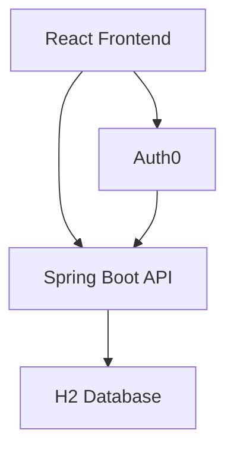
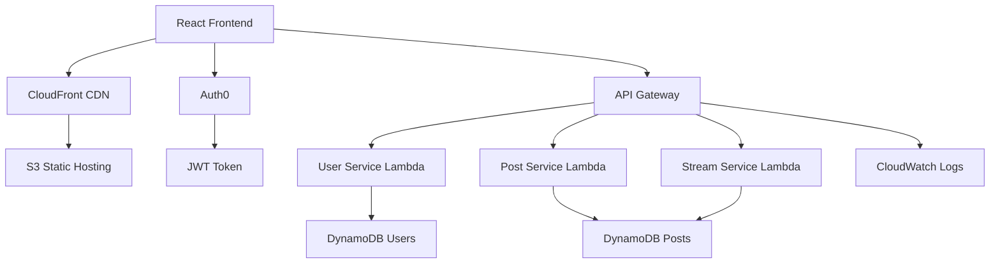

# TDSE Twitter-like Application

[](https://github.com/RichardLitt/standard-readme)

**Escuela Colombiana de Ingeniería Julio Garavito**  
**Students:** Santiago Amaya Zapata, Andrés Ricardo Ayala Garzón & Santiago Botero García

A full-stack Twitter-like application with **Spring Boot, React, Auth0 authentication, and AWS serverless microservices**, built for the TDSE course.

---

## Table of Contents

* [Background](#background)
* [Install](#install)
* [Usage](#usage)
* [Architecture](#architecture)
* [API](#api)
* [Testing](#testing)
* [Deployment](#deployment)
* [Live Demo](#live-demo)
* [License](#license)

---

## Background

This project demonstrates the design and implementation of a Twitter-like platform with:

* Secure authentication using **Auth0 (OAuth2 + JWT)**
* A **Spring Boot monolith** for local development
* A **serverless microservices architecture on AWS** for production
* A **React frontend** with responsive UI

The goal is to showcase:

* Secure API design
* Scalable architecture evolution
* Full-stack development best practices

---

## Install

### Prerequisites

* Java 17+
* Node.js 18+
* Maven
* AWS CLI configured
* Auth0 account

---

### Clone repository

```bash
git clone https://github.com/SantiagoAmaya21/TDSE-Microservicios.git
cd TDSE-Microservicios
```

---

### Backend setup

```bash
mvn clean install
mvn spring-boot:run
```

Runs on: `http://localhost:8080`

---

### Frontend setup

```bash
cd frontend
npm install
npm start
```

Runs on: `http://localhost:3000`

---

### Auth0 configuration

Update:

* `application.properties` (backend)
* `.env.local` (frontend)

---

## Usage

### Run locally

1. Start backend
2. Start frontend
3. Open `http://localhost:3000`

---

### Example API usage

#### Get public posts

```bash
curl http://localhost:8080/api/posts
```

#### Create post (authenticated)

```bash
curl -X POST http://localhost:8080/api/posts \
  -H "Authorization: Bearer YOUR_TOKEN" \
  -H "Content-Type: application/json" \
  -d '{"content":"Hello world"}'
```

---

## Architecture

### 1. Monolith (Development)



---

### 2. Serverless Microservices (Production)



---

### Architecture Notes

* API Gateway handles routing and authentication
* Each Lambda is independently deployable
* DynamoDB used for scalable storage
* CloudFront improves frontend performance

---

## API

### Authentication

All protected endpoints require:

```
Authorization: Bearer <JWT>
```

---

### Public Endpoints

* `GET /api/posts`
* `GET /api/stream`
* `GET /api/users`
* `GET /api/users/{username}`
* `GET /api/posts/{id}`

---

### Protected Endpoints

* `POST /api/posts`
* `DELETE /api/posts/{id}`
* `GET /api/users/me`

---

### Swagger Documentation

Available at:

```
http://localhost:8080/swagger-ui.html
```

---

## Testing

### Backend

* 22 tests (100% passing)
* JUnit 5 + Mockito
* Service and controller coverage

```bash
mvn test
```

---

### Frontend

* 73 tests implemented
* Covers components and API layer

```bash
npm test
```

Known issue:

* Jest environment requires polyfills (`TextEncoder`)

---

## Deployment

### Overview

Deployment is performed **manually (no CI/CD)** using AWS services.

---

### Steps

#### 1. Build frontend

```bash
npm run build
```

#### 2. Deploy to S3

```bash
aws s3 sync build/ s3://your-bucket-name --delete
```

#### 3. Deploy Lambdas

```bash
mvn clean package
serverless deploy
```

#### 4. Configure API Gateway

* Connect endpoints to Lambda functions
* Enable JWT authorizer (Auth0)

---

### Infrastructure

* **AWS Lambda** -> backend services
* **API Gateway** -> routing + auth
* **DynamoDB** -> database
* **S3 + CloudFront** -> frontend hosting

---

## Live Demo

* **Frontend URL**: [Deployed S3 Website URL]
* **API Documentation**: [Swagger UI URL]
* **API Base URL**: [API Gateway URL]

---

## License

MIT License TDSE Team
