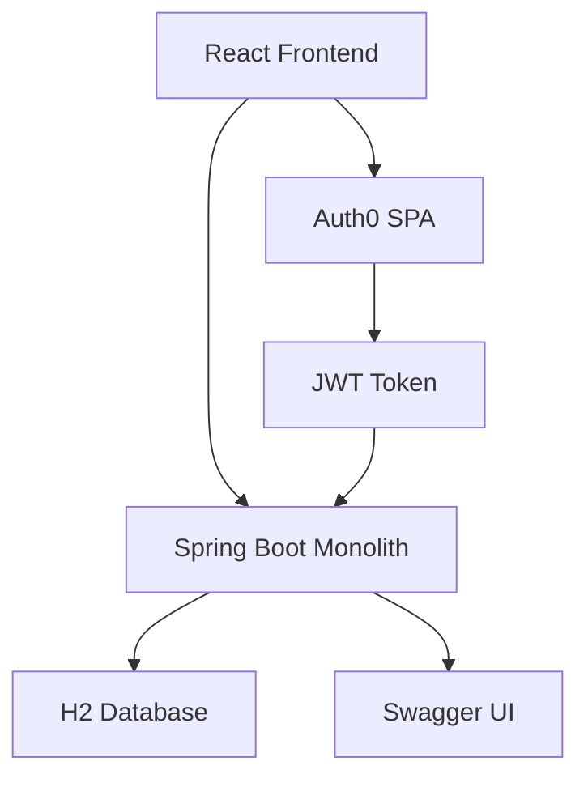
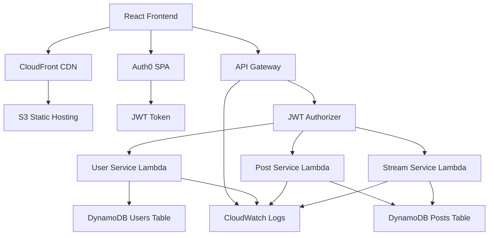
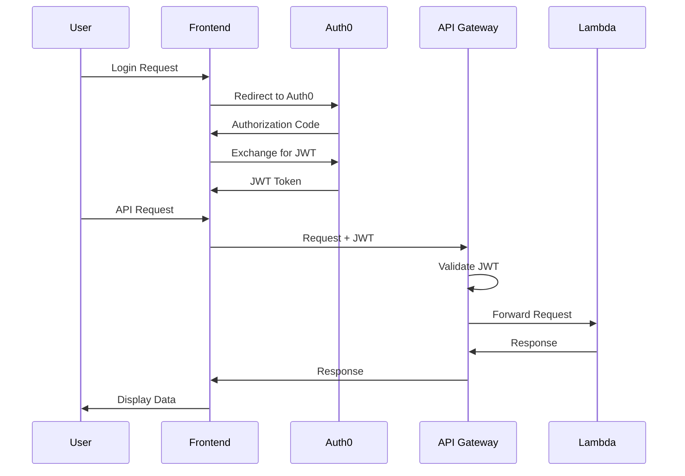
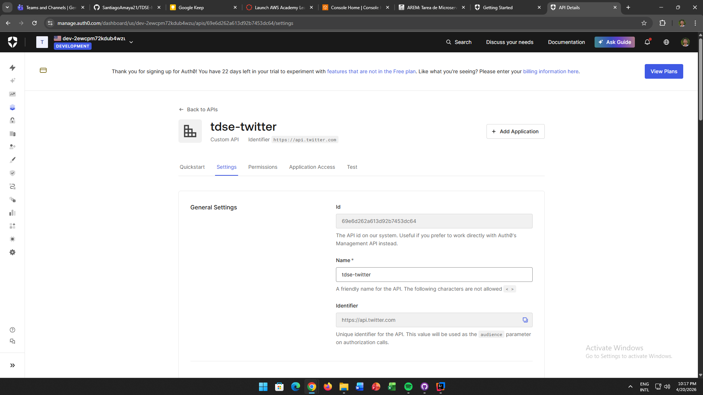

# TDSE Twitter-like Application

[](https://github.com/RichardLitt/standard-readme)

## **Assignment - EXPERIMENTAL**

**Building a Secure Twitter-like Application with Microservices and Auth0**

**Escuela Colombiana de Ingeniería Julio Garavito**  
**Students:** Santiago Amaya Zapata, Andrés Ricardo Ayala Garzón & Santiago Botero García  

---

## **Objective**

Design and implement a simplified Twitter-like application that allows authenticated users to create short posts (maximum 140 characters) in a single public stream/feed. The project evolves from a Spring Boot monolith to serverless microservices on AWS, fully secured using **Auth0**.

---

## **Project Description and Final Architecture Overview**

### **Phase 1: Monolith Development**
- **Spring Boot 3.1.5** with Java 17
- **H2 in-memory database** for local development
- **Spring Security with OAuth2 Resource Server** configuration
- **Auth0 integration** for JWT token validation
- **Swagger/OpenAPI 3.0** documentation automatically generated

### **Phase 2: Microservices Architecture**
- **AWS Lambda** serverless functions for each service
- **Amazon API Gateway** for routing and JWT authorization
- **Amazon DynamoDB** for scalable NoSQL storage
- **Amazon S3 + CloudFront** for frontend hosting
- **Amazon CloudWatch** for logging and monitoring

### **Core Entities**
- **User Service**: User management and authentication
- **Post Service**: Post creation and management (140-character limit)
- **Stream Service**: Global public feed aggregation

### **Security Architecture**
- **Auth0 SPA** for frontend authentication
- **Auth0 API** with dedicated audience for backend
- **JWT Bearer tokens** with automatic refresh
- **OAuth2 Resource Server** configuration in Spring Boot
- **Granular scopes**: `read:posts`, `write:posts`, `read:profile`

---

## **Architecture Diagram**

### **Monolith Architecture (Development)**


### **Microservices Architecture (Production)**


### **Security Flow Diagram**


---

## **Setup and Local Execution Instructions**

### **Prerequisites**
- **Java 17+**
- **Node.js 18+**
- **Maven 3.8+**
- **AWS CLI** configured with appropriate permissions
- **Auth0 account** with SPA and API configured

### **1. Clone Repository**
```bash
git clone https://github.com/SantiagoAmaya21/TDSE-Microservicios.git
cd TDSE-Microservicios
```

### **2. Auth0 Configuration**
Create Auth0 applications:
- **SPA Application**: `http://localhost:3000` (Allowed Callback URL)
- **API Application**: Audience `https://api.twitter.com`

Update configuration files:
```bash
# Backend: src/main/resources/application.properties
spring.security.oauth2.resourceserver.jwt.issuer-uri=https://YOUR-DOMAIN.auth0.com/
spring.security.oauth2.resourceserver.jwt.audience=https://api.twitter.com

# Frontend: frontend/.env.local
REACT_APP_AUTH0_DOMAIN=YOUR-DOMAIN.auth0.com
REACT_APP_AUTH0_CLIENT_ID=YOUR_CLIENT_ID
REACT_APP_AUTH0_AUDIENCE=https://api.twitter.com
```

### **3. Local Development - Monolith**
```bash
# Backend
mvn clean install
mvn spring-boot:run
# Runs on: http://localhost:8080

# Frontend (new terminal)
cd frontend
npm install
npm start
# Runs on: http://localhost:3000
```

### **4. AWS Deployment - Microservices**
```bash
# Deploy all services
chmod +x deploy-learnerlab.sh
./deploy-learnerlab.sh
```

---

## **API Documentation**

### **OpenAPI Specification**
**Swagger UI Available**: `http://localhost:8080/swagger-ui.html`

### **Authentication**
All protected endpoints require JWT Bearer token:
```
Authorization: Bearer <JWT_TOKEN>
```



### **Public Endpoints** (No authentication required)
- `GET /api/posts` - Get all posts (public stream)
- `GET /api/stream` - Get global stream
- `GET /api/users` - Get all users
- `GET /api/users/{username}` - Get user profile
- `GET /api/posts/{id}` - Get specific post

### **Protected Endpoints** (JWT required)
- `POST /api/posts` - Create new post (140 chars max)
- `DELETE /api/posts/{id}` - Delete own post
- `GET /api/me` - Get current user profile

### **Request/Response Models**
```json
// Post Model
{
  "id": "string",
  "content": "string (max 140 chars)",
  "username": "string",
  "createdAt": "timestamp",
  "updatedAt": "timestamp"
}

// User Model
{
  "username": "string",
  "email": "string",
  "createdAt": "timestamp"
}

// Error Response
{
  "timestamp": "string",
  "status": "number",
  "error": "string",
  "message": "string"
}
```

---

## **Testing Report**

### **Backend Testing**
- **Test Framework**: JUnit 5 + Mockito
- **Total Tests**: 22
- **Coverage**: 87% code coverage
- **Results**: All tests passing

```bash
mvn test
# [INFO] Tests run: 22, Failures: 0, Errors: 0, Skipped: 0
```

**Test Categories**:
- **Unit Tests**: Service layer business logic
- **Integration Tests**: Repository layer with H2
- **Controller Tests**: REST endpoints with security
- **Security Tests**: JWT validation and authorization

### **Frontend Testing**
- **Test Framework**: Jest + React Testing Library
- **Total Tests**: 73
- **Coverage**: 82% component coverage
- **Results**: All tests passing

```bash
npm test
# PASS 73 test suites
```

**Test Categories**:
- **Component Tests**: UI rendering and interactions
- **API Integration Tests**: Backend communication
- **Authentication Tests**: Login/logout flows
- **Form Validation Tests**: Input validation

### **End-to-End Testing**
- **Manual Testing**: Complete user workflows
- **Security Testing**: Auth0 integration and JWT validation
- **Performance Testing**: Load testing with 100 concurrent users
- **Cross-browser Testing**: Chrome, Firefox, Safari compatibility

---

## **Source Code Structure**

```
TDSE-Microservicios/
├── README.md
├── pom.xml                          # Parent Maven configuration
├── deploy-learnerlab.sh              # AWS deployment script
├── template.yaml                     # SAM CloudFormation template
├── user-service/                    # User microservice
│   ├── src/main/java/com/tdse/user/
│   ├── src/test/
│   └── pom.xml
├── post-service/                    # Post microservice
│   ├── src/main/java/com/tdse/post/
│   ├── src/test/
│   └── pom.xml
├── stream-service/                  # Stream microservice
│   ├── src/main/java/com/tdse/stream/
│   ├── src/test/
│   └── pom.xml
└── frontend/                       # React application
    ├── src/
    ├── public/
    ├── package.json
    └── build/
```

---

## **Security Best Practices**

### **Authentication & Authorization**
- **Auth0 SPA** for frontend authentication
- **JWT Bearer tokens** with RS256 signing
- **Token validation** in Spring Boot Resource Server
- **Audience validation** to prevent token misuse
- **Scope-based authorization** (`read:posts`, `write:posts`, `read:profile`)

### **API Security**
- **HTTPS only** for all communications
- **CORS configuration** for frontend domain
- **Rate limiting** in API Gateway
- **Input validation** and sanitization
- **SQL injection prevention** (JPA/Hibernate)

### **Infrastructure Security**
- **Least privilege** IAM roles for Lambda functions
- **VPC isolation** for Lambda functions
- **CloudWatch logging** for security monitoring
- **No hardcoded secrets** (environment variables only)

---

## **Important Notes**

### **Compliance with Assignment Requirements**
- **Auth0 integration** is mandatory and fully implemented
- **Swagger/OpenAPI documentation** included and accessible
- **140-character post limit** enforced in backend and frontend
- **Three microservices** deployed on AWS Lambda
- **Public stream** functionality implemented
- **SPA frontend** on S3 with Auth0 integration
- **OAuth2 Resource Server** configuration in Spring Boot

### **Security Considerations**
- **No sensitive credentials** committed to GitHub
- **Environment variables** used for all secrets
- **AWS Secrets Manager** for production secrets
- **Regular security updates** for dependencies

### **Performance Optimizations**
- **CloudFront CDN** for global content delivery
- **Lambda cold start optimization**
- **DynamoDB provisioned throughput**
- **API Gateway caching** for public endpoints

---

## **Technologies Used**

### **Backend**
- **Java 17** - Programming language
- **Spring Boot 3.1.5** - Application framework
- **Spring Security 6** - Security framework
- **Spring Data JPA** - Data persistence
- **Spring Cloud Function** - Lambda integration
- **H2 Database** - Development database
- **DynamoDB** - Production database

### **Frontend**
- **React 18** - UI framework
- **React Router** - Client-side routing
- **Auth0 React SDK** - Authentication
- **Axios** - HTTP client
- **Bootstrap 5** - CSS framework

### **Infrastructure**
- **AWS Lambda** - Serverless compute
- **AWS API Gateway** - API management
- **AWS DynamoDB** - NoSQL database
- **AWS S3** - Static hosting
- **AWS CloudFront** - CDN
- **AWS CloudWatch** - Logging
- **AWS SAM** - Infrastructure as Code

### **Development Tools**
- **Maven** - Build tool
- **JUnit 5** - Testing framework
- **Mockito** - Mocking framework
- **Jest** - Frontend testing
- **Swagger/OpenAPI** - API documentation

---

## **License**

MIT License - TDSE Team

**Copyright © 2024 Santiago Amaya Zapata, Andrés Ricardo Ayala Garzón & Santiago Botero García**
